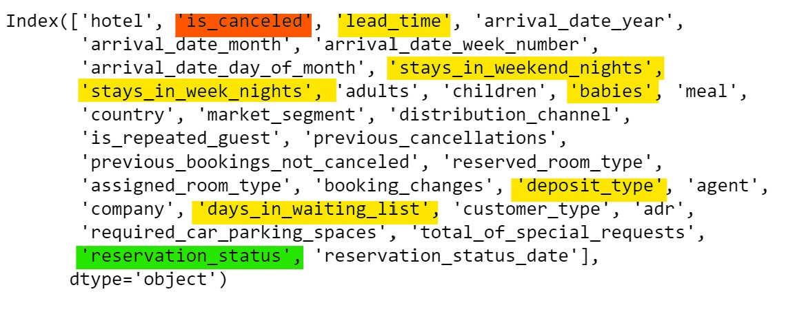
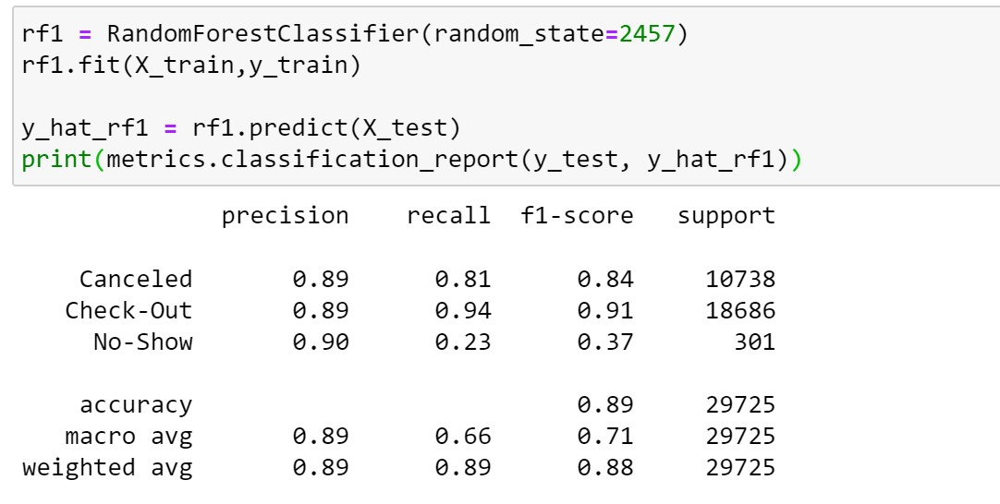
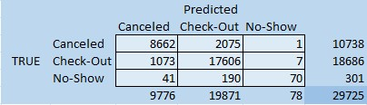
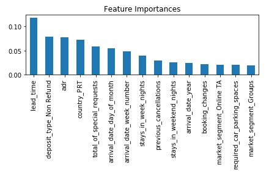

# An Analysis of Hotel Reservations
Are reservation cancelations and no-shows predictable? 
How can hotels combat this this problem?

## Introduction to Problem
In today’s day and age, hotels have a reservation paradox on their hands.  Ideally, a hotel wants to fill every room they have every night in order to maximize their profits.  Most people have their travels planned, so hotels cater to this by offering reservations for their hotel rooms.  Of course, hotels run into the inevitable problem: travel plans change.  Hotels are required to walk a fine line.  If every room is reserved for a future night, what are they supposed to do if they believe they will have cancellations or no shows?  Do they overbook in anticipation of this phenomenon?  
Andrew and I set out to come to the aid of hotels hoping to address this problem.  We are going to analyze a dataset of hotel reservations to see if we can predict if a reservation will follow through and stay the allotted nights, if they will cancel their reservation, or if they will not show up without any explanation.  We plan to develop a model that could look at future reservations and help hotel managers predict what the guest will end up doing.  Ideally this could help them overbook just the right number of rooms so that when people cancel or no-show, the hotel is not left with empty rooms generating no revenue.  
In addition to using our model to predict future reservation outcomes, we also plan to use it to find insights into what kind of things make people more likely to cancel or not show up.  This information could be used to find ways to better accommodate guests before their stay even begins, hopefully reducing cancellation rates and improving the customer’s experience.

## Data Background
The data is lots of information about a certain hotel reservation.  The 30 explanatory variables include information on the date of the hotel stay, the lead time in which the booking was made, information about the guest, including previous history, the number of guests staying with them, and if they are traveling with child or not.  Our target variable is the outcome of the reservation and has three possible responses.  The guest showed up for their reservation and has now checked-out, the guest canceled their stay prior to arriving, or the guest was a no-show (having neither shown up nor gone through the proper cancelation process).
This dataset was originally made public here: https://www.sciencedirect.com/science/article/pii/S2352340918315191#f0010

Here is a list of model variables.  The one highlighted in green is our target variable, the one in red confounds the model so we will be dropping it.  The ones highlighted in yellow are my early predictions for variables I think will be influential. 

## Method and Results
We used several classification models and did some tweaking on each one in attempt to find the best model.  We are defining “best” as them model that produces the highest accuracy, meaning it predicts the most outcomes correctly.
We tried logistic regression, K-Nearest Neighbors, Decision Trees, Multinomial Naïve Bayes, and Random Forests.  Random Forests ending up being our top model.  As you can see in the image below, this model had an accuracy of 0.89.

We are happy with 0.89, but looking at our confusion matrix, there is still room for improvement, especially with predicting no-show guests.  

## Influential Variables
After finding the model with parameters, we wanted to explore what parameters were most influential.  We began by creating a new random forest model, but this time we used all the data available, instead of splitting any into a train and test set.  After creating this model, we used the function feature_importances_ to find the impurity decrease value for each explanatory variable in our model.  A higher value indicates that it is more important in our model than variables with lower values. Below is a bar graph of the results.

Our top three influential parameters were lead time, deposit type being non-refundable, and the average daily rate.  The first two are fairly intuitive.  You are less likely to follow through on a reservation the farther out you book your stay.  Also, paying a non-refundable deposit is a big incentive not to cancel.  Our third influencer, however, is a little more difficult to do inference on.  Is it the expensive hotels that are more likely to have cancellations?  Or just the opposite?  Ideally, we would have a coefficient that could tell us this information, but we don’t, and that is one are we would like to further explore. 

## Conclusion
We feel like this model could really benefit hotels.  Marriot is reported to have 1,424,044 rooms across all their properties.  Every night they have millions of dollars in revenue all dependent on whether people follow through with their reservations and guests check into their hotel.  This model would be beneficial to companies like theirs so that they could understand the likelihood of a reservation cancelling, and the probable number of total cancellations for a given evening.  They could then use this information to overbook full hotels so that when people cancel, there are others to take their place.

Additionally, the analysis of model features could be turned over to the customer service team to investigate ways to improve the likelihood that reservations follow through with their reservation and necessary accommodations are being made.  

I personally thought this was a really neat project because it is quite a real problem for a massive industry.  It was also the first classification model that I was apart of building that had three possible outcomes rather than just two.

Thanks for reading, hope you enjoyed our analysis.

